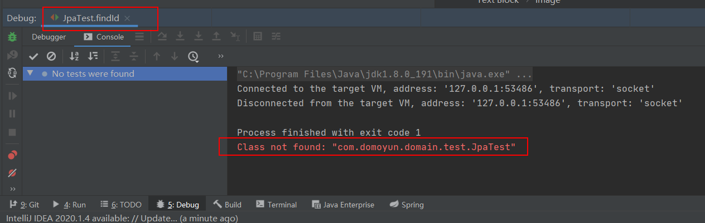
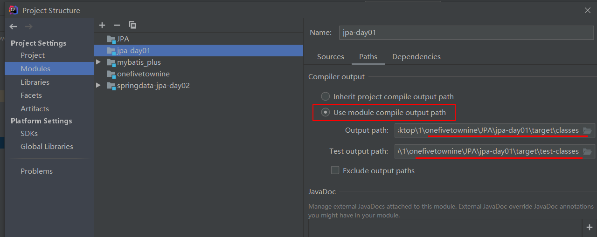
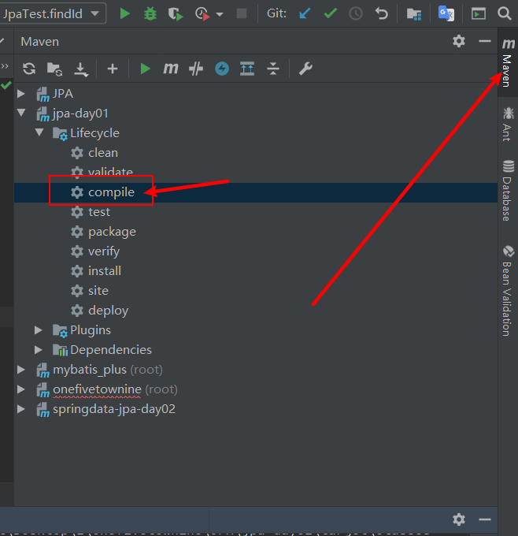
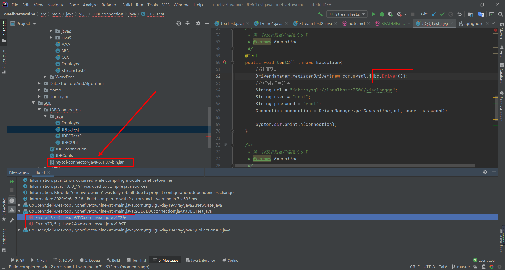
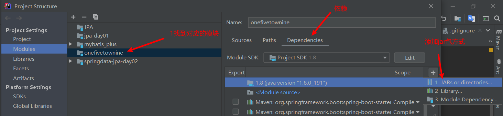
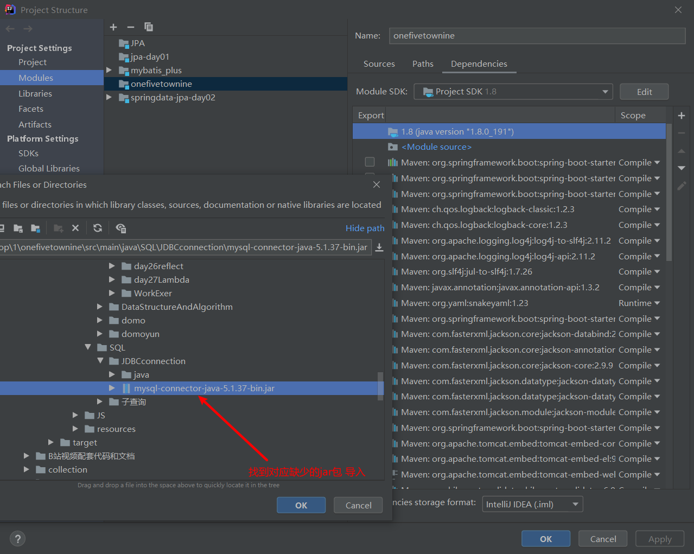

# 代码练习合集

# 代码导入运行说明
### 项目导入后1.首先指定maven依赖配置文件以及maven仓库地址

### 导入工程后常见问题1 IDEA 单元测试报错：Class not found

ctrl+alt+shift+s 打开项目工程结构配置

确认路径无误后，

### 导入工程后常见问题2 编译工程提示缺少依赖

ctrl+alt+shift+s 打开项目工程结构配置

找到对应的jar包后导入 保存应用配置

以后缺少第三方jar包，手动导入的方式都是以这种方式

这样您就可以尽情的DEBUG里面的demo集合啦~

